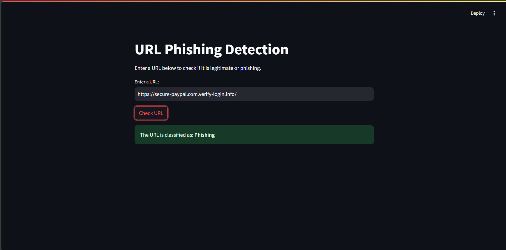
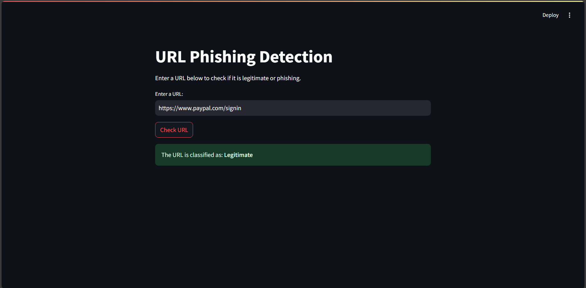

# Title: Phishing Detection
## Technologies Used :
```
Data Analysis Using Python,
Random Forest Classification
(Machine Learning)
```

## Commands For Running Project :

```
pip install pandas scikit-learn joblib tldextract
pip install streamlit
```
## To Clone :
```
git clone https://github.com/shangarwarsandesh/Phishing-Detection.git
```


## Steps to Develop Project :

### **1. Define the Objective**  
- Clearly outline the goal: **Detect phishing URLs** by analyzing their structure and domain-related features.  
- Determine whether the system will work on static datasets or real-time URL inputs.  

### **2. Data Collection**  
- Gather a dataset of phishing and legitimate URLs from sources like:  
  - OpenPhish, PhishTank, Kaggle datasets.  
  - Web scraping tools or security databases.  
- Ensure diversity in the dataset, including different domain structures and URL formats.  

### **3. Data Preprocessing**  
- **Label the Data**: Classify URLs as “phishing” or “legitimate.”  
- **Feature Extraction**: Extract important URL-based features like:  
  - Domain length, presence of special characters (`-`, `_`), subdomains.  
  - Use of IP addresses instead of domain names.  
  - Presence of sensitive keywords like "login," "verify," "secure."  
- **Data Cleaning**: Remove duplicate and corrupted URLs.  

### **4. Model Selection**  
- Choose a machine learning approach for classification:  
  - **Random Forest, Decision Trees, Logistic Regression** for traditional ML.  
  - **Deep Learning (LSTMs, CNNs for text analysis)** for advanced detection.  

### **5. Model Training**  
- Split the dataset into **training (70%), validation (20%), and test (10%)** sets.  
- Train the model on extracted features and tune hyperparameters.  
- Prevent overfitting using **cross-validation** and regularization.  

### **6. Model Evaluation**  
Evaluate performance using:  
- **Accuracy**: How often the model correctly classifies URLs.  
- **Precision, Recall, and F1-score**: Useful for imbalanced datasets.  
- **Confusion Matrix**: Shows the breakdown of correct vs. incorrect predictions.  

### **7. Deployment Preparation**  
- Optimize the model for **real-time detection** by reducing complexity.  
- Convert the trained model into a portable format using **joblib or ONNX**.  

### **8. Build a User Interface**  
- Develop a **Streamlit web app** 🖥️ where users can enter URLs and get real-time predictions.  
- Display results with probability scores (e.g., 90% phishing, 10% safe).  

### **9. Testing and Validation**  
- Test the system with new, unseen URLs.  
- Gather feedback and analyze false positives/negatives.  

### **10. Deployment and Maintenance**  
- Deploy on **cloud services (AWS, Heroku, or Google Cloud)** for real-time detection.  
- Continuously update the model with **new phishing patterns** and retrain.  

### **11. Documentation and Reporting**  
- Document the dataset, model architecture, training process, and results.  
- Create a user manual for non-technical users.  

### **12. Future Enhancements**  
- **Use NLP techniques** to analyze webpage content along with URLs.  
- **Integrate browser extensions** for real-time phishing alerts.  
- **Enhance the UI** with visual threat analysis dashboards.  

This workflow ensures a robust and scalable **phishing detection system**! 🚀🔐 

## Screenshots :

### Phishing Example


### Legitimate Example


## Author :
```
Sandesh Shangarwar
```
